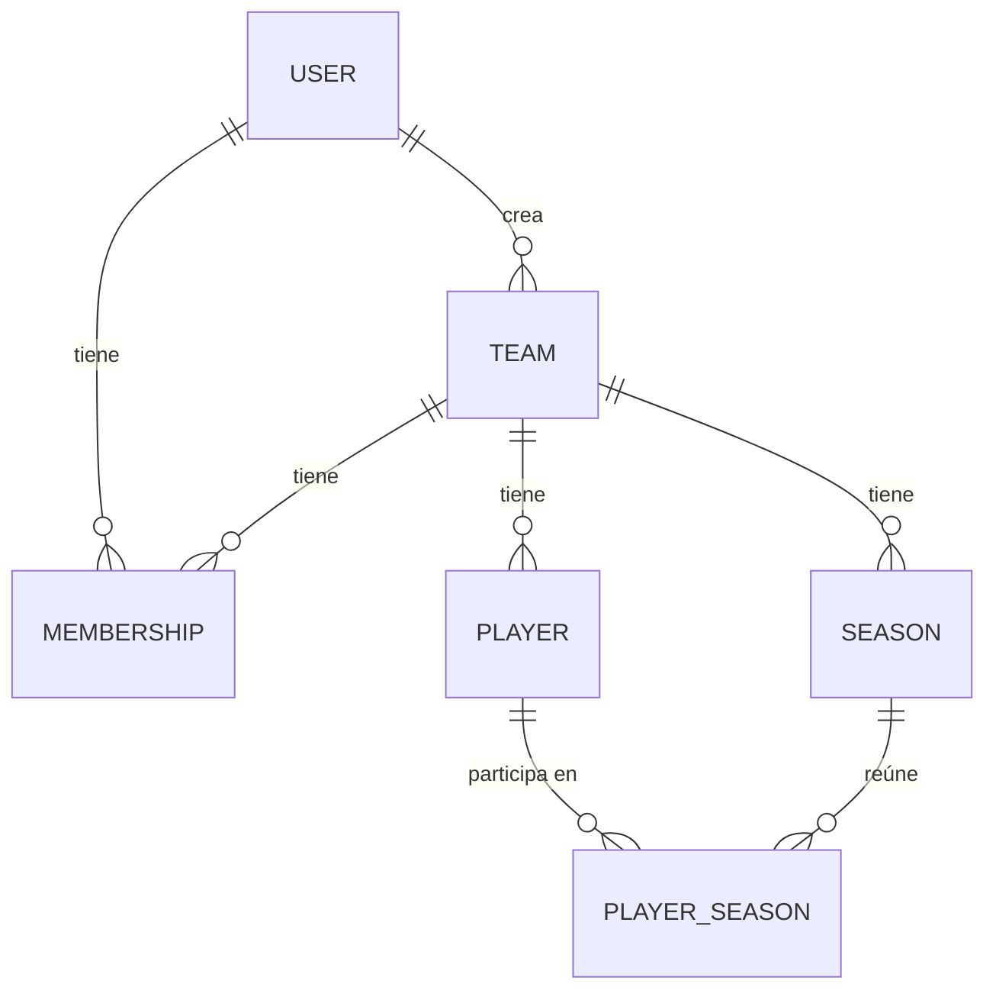
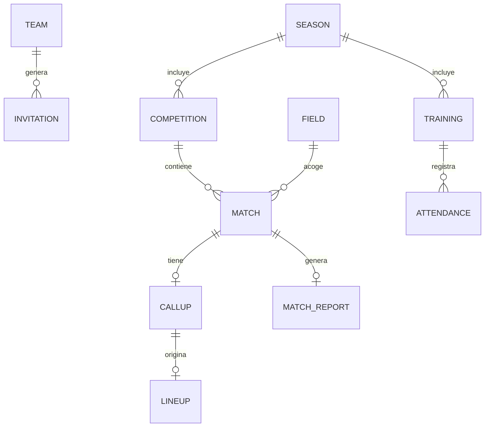

# Modelo de datos

Este documento describe las entidades de GesCoach, cómo se relacionan y qué datos se guardan frente a cuáles se calculan. Cada entidad indica si ya está **implementada** o solo **diseñada**, para que el documento no prometa lo que todavía no existe.

## Principios

- **El equipo es continuo; la temporada cambia.** Lo que varía cada año (categoría, división, modalidad, duración del partido) pertenece a la temporada, no al equipo. Así el historial se conserva al subir de categoría.
- **Persona y participación por separado.** Un jugador es una persona con datos estables. Su ficha, dorsal, posiciones y estado dependen de la temporada y viven en otra entidad.
- **Archivar, no borrar.** Al finalizar una temporada se cierra y se crea la siguiente. Los datos históricos siguen apuntando a jugadores que existen.
- **Calcular en lugar de guardar.** Los valores que cambian con el tiempo o se derivan de otros datos (edad, años de contrato, clasificación, estadísticas) no se almacenan.
- **El rol vive en la relación.** Un usuario no tiene un rol: tiene un rol *en cada equipo* a través de su membresía.

## Diagrama de lo implementado

## Entidades implementadas

Todas incluyen `createdAt` y `updatedAt`, generados automáticamente.

### User

La persona que inicia sesión.

| Campo | Tipo | Notas |
|---|---|---|
| `email` | texto | Obligatorio, único, en minúsculas |
| `name` | texto | Obligatorio |
| `surname` | texto | Obligatorio |
| `birthDate` | fecha | Obligatoria |
| `locale` | `es` / `gl` / `en` | Idioma de la interfaz. Por defecto `es` |
| `passwordHash` | texto | Hash de la contraseña. **Nunca se devuelve** en las consultas |

Calculado: `age`.

### Team

El equipo como entidad continua entre temporadas.

| Campo | Tipo | Notas |
|---|---|---|
| `name` | texto | Obligatorio, máximo 60 caracteres |
| `primaryColor` | texto | Color hexadecimal, por ejemplo `#1d4ed8` |
| `secondaryColor` | texto | Color hexadecimal |
| `fieldName` | texto | Nombre del campo local |
| `fieldLocation` | texto | Opcional |
| `badgeUrl` | texto | Opcional. Dirección de la imagen del escudo, nunca el archivo. Se rellenará cuando exista la subida de imágenes |
| `createdBy` | referencia a User | Quien creó el equipo |

El campo local es texto simple. Cuando se importen los calendarios de la federación pasará a ser una entidad propia (ver *Previsto*).

### Season

Una temporada de un equipo. Aquí viven los datos que cambian cada año.

| Campo | Tipo | Notas |
|---|---|---|
| `team` | referencia a Team | Obligatorio |
| `startYear` | número | `2026` significa la temporada 2026/2027 |
| `category` | lista cerrada | `prebenjamin`, `benjamin`, `alevin`, `infantil`, `cadete`, `juvenil` |
| `modality` | `f7` / `f8` / `f11` | Condiciona formaciones y número de titulares |
| `division` | texto | Libre, porque depende de la federación y del grupo |
| `matchDuration` | número | Duración total del partido, en minutos |
| `isCurrent` | booleano | Solo una temporada por equipo puede ser la actual |
| `closedAt` | fecha | Se rellena al finalizar la temporada. Vacío mientras siga abierta |

Restricción: un índice único parcial impide tener dos temporadas actuales en el mismo equipo.

### Membership

Relaciona un usuario con un equipo y le asigna un rol. Ver [roles y permisos](./roles-y-permisos.md).

| Campo | Tipo | Notas |
|---|---|---|
| `user` | referencia a User | Obligatorio |
| `team` | referencia a Team | Obligatorio |
| `role` | lista cerrada | `head_coach`, `assistant_coach`, `delegate`, `team_manager`, `medical` |

Restricciones:

- Un usuario solo puede tener una membresía por equipo.
- Cada equipo tiene un único `head_coach` (índice único parcial).

### Player

El jugador como **persona**. No cambia al cambiar de temporada.

| Campo | Tipo | Notas |
|---|---|---|
| `team` | referencia a Team | Obligatorio |
| `name` | texto | Obligatorio |
| `surname` | texto | Obligatorio |
| `nickname` | texto | Opcional. Nombre futbolístico, el que aparece en convocatorias |
| `birthDate` | fecha | Obligatoria |
| `nationality` | texto | Opcional. Código de país de 2 letras (`ES`) |
| `guardians` | lista | Opcional. Tutores (ver abajo) |
| `contract` | objeto | Opcional. Contrato (ver abajo) |

Cada elemento de `guardians`:

| Campo | Notas |
|---|---|
| `name` | Obligatorio |
| `relationship` | Obligatorio, texto libre (madre, padre, tutor...) |
| `phone` | Opcional |
| `email` | Opcional |

El objeto `contract`:

| Campo | Notas |
|---|---|
| `endDate` | Obligatoria si hay contrato |
| `startDate` | Opcional |
| `salary` | Opcional, en euros |
| `salaryPeriod` | `monthly` o `yearly`. Obligatorio si hay sueldo |

El contrato está en la persona y no en la temporada porque suele durar varias. Con un único contrato incrustado no hay historial de renovaciones ni de cambios de sueldo; si algún día hiciera falta, pasaría a ser su propia colección.

Calculados: `age` y `yearsLeft` (años de contrato que quedan).

### PlayerSeason

El jugador **dentro de la plantilla de una temporada**. Al finalizar la temporada estos documentos se conservan como histórico.

| Campo | Tipo | Notas |
|---|---|---|
| `player` | referencia a Player | Obligatorio |
| `season` | referencia a Season | Obligatorio |
| `licenseCategory` | lista cerrada | Tipo de ficha en esa temporada. Mismas categorías que Season |
| `jerseyNumber` | número 0-99 | Opcional. Dorsal fijo de la temporada |
| `mainPosition` | lista cerrada | Posición principal |
| `secondaryPositions` | lista | Posiciones secundarias |
| `status` | lista cerrada | `available`, `injured`, `suspended`, `inactive` |

Restricciones:

- Un jugador solo aparece una vez en la plantilla de cada temporada.
- El dorsal no se repite dentro de una temporada. El índice es parcial: solo cuenta a quienes tienen dorsal, porque varios pueden no tenerlo.
- La posición principal no puede repetirse entre las secundarias.
- El cambio puntual de dorsal en un partido no se guarda aquí, sino en la convocatoria de ese partido.

El estado guarda solo la situación del jugador, sin detalles clínicos.

## Posiciones

Se guarda la posición concreta. El grupo se deduce de ella con una tabla en el código, de modo que no pueden contradecirse.

| Grupo | Posiciones (clave) |
|---|---|
| Portero | `portero` |
| Defensas | `central`, `lateral_izquierdo`, `lateral_derecho`, `carrilero_izquierdo`, `carrilero_derecho`, `libero` |
| Centrocampistas | `pivote`, `mediapunta`, `interior_derecho`, `interior_izquierdo`, `mediocentro` |
| Atacantes | `extremo_derecho`, `extremo_izquierdo`, `segundo_delantero`, `delantero_centro` |

La abreviatura que se muestra en la plantilla (por ejemplo `ED` para extremo derecho) también se calcula en el cliente a partir de la clave.

## Datos guardados y datos calculados

| Valor | Cómo se obtiene |
|---|---|
| Edad (usuario y jugador) | Desde `birthDate`, a fecha de hoy |
| Años de contrato restantes | Desde `contract.endDate`, a fecha de hoy |
| Grupo de posición | Tabla de posiciones |
| Temporada como texto (`2026/2027`) | Desde `startYear` |
| Categoría y modalidad para mostrar | Tablas de etiquetas en el cliente |
| Clasificación *(previsto)* | Desde los resultados de los partidos |
| Estadísticas de jugadores y equipo *(previsto)* | Desde las actas de los partidos |

## Previsto

Estas entidades están diseñadas a grandes rasgos y **pueden cambiar** cuando se implementen. Se incluyen para que el modelo actual no cierre ninguna puerta.

### Invitation

Permite a quien creó el equipo invitar a otros miembros mediante un enlace.

| Campo | Notas |
|---|---|
| `team` | Equipo al que se invita |
| `role` | Rol que tendrá quien acepte. Nunca `head_coach` |
| `tokenHash` | Hash del token. El token en claro solo existe en el enlace |
| `invitedBy` | Usuario que invita |
| `expiresAt` | Fecha de creación más 7 días |
| `usedAt` | Se rellena al aceptarla. **Un solo uso** |

El rol lo fija quien invita, nunca quien acepta. Quien se registra desde una invitación no pasa por el asistente de creación de equipo: entra directamente en el equipo al que le han invitado.

### Competition

Agrupa las reglas de una competición dentro de una temporada: liga, copa, torneo o amistosos. Las reglas dependen de la competición y no del partido.

- Máximo de convocados (por ejemplo, 16 en liga; sin límite en amistosos, copa o torneo).
- Duración del partido.
- Si cuenta para la clasificación.
- Equipos rivales participantes, reutilizables entre competiciones.

### Match

Un partido dentro de una competición, con jornada, equipo local y visitante, campo, fecha y hora (la hora puede estar pendiente de confirmar) y resultado. El resultado puede ser provisional hasta que llegue el acta.

Ciclo de vida: programado, convocatoria, alineación y acta.

### Field

Entidad propia para los campos, porque un mismo campo lo usan varios equipos y puede escribirse de formas distintas según la fuente.

### Callup, Lineup y MatchReport

- **Callup (convocatoria):** jugadores convocados, respetando el máximo de la competición. Aquí se guarda el cambio puntual de dorsal de un partido.
- **Lineup (alineación):** formación elegida (depende de la modalidad), once inicial y suplentes. Los titulares salen de los convocados.
- **MatchReport (acta):** goleadores, asistentes, tarjetas y cambios. De ella salen los minutos, goles, asistencias y tarjetas de cada jugador.

### Training y Attendance

Entrenos con fecha y objetivos, y el registro de asistencia de cada jugador. Los estados de asistencia (presente, ausente justificado, ausente sin avisar...) están por definir.
